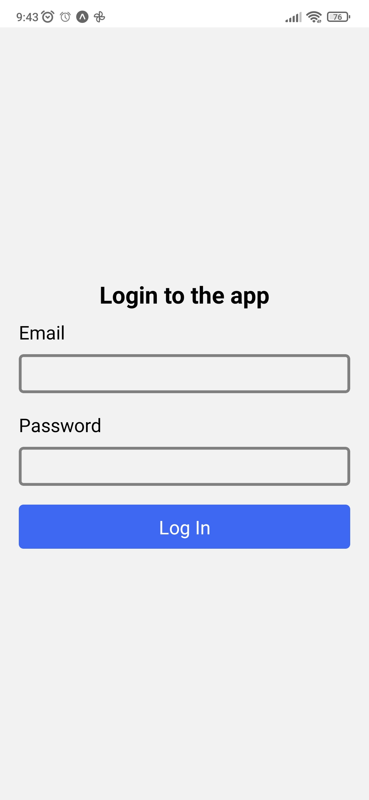
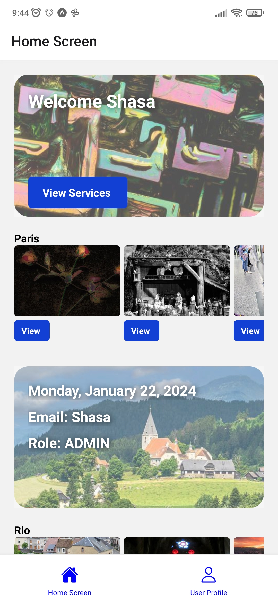
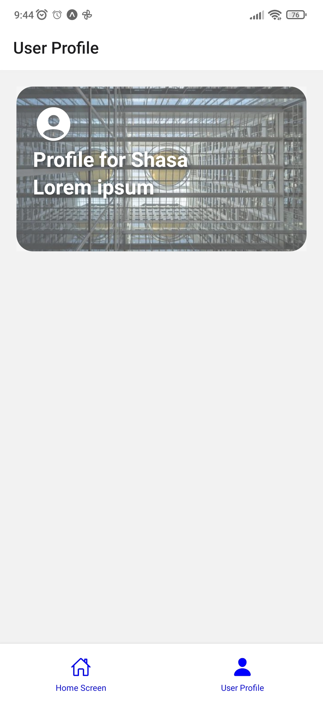
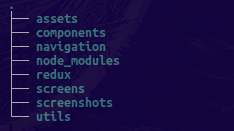
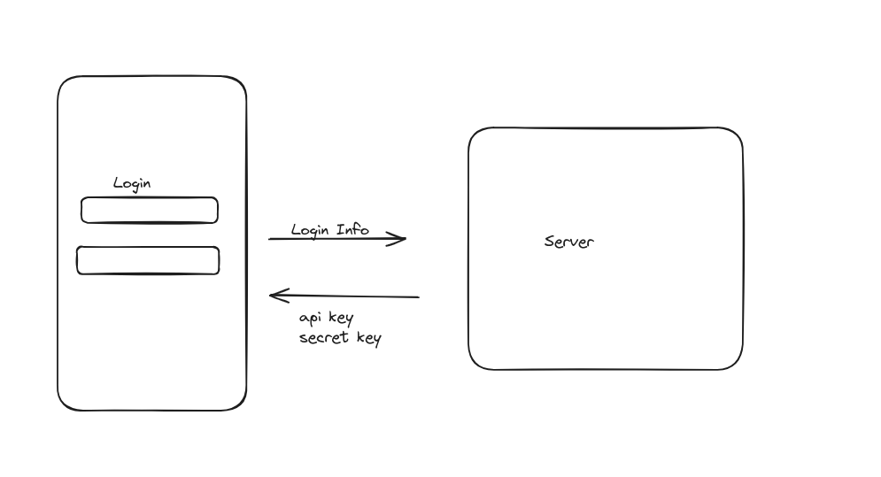
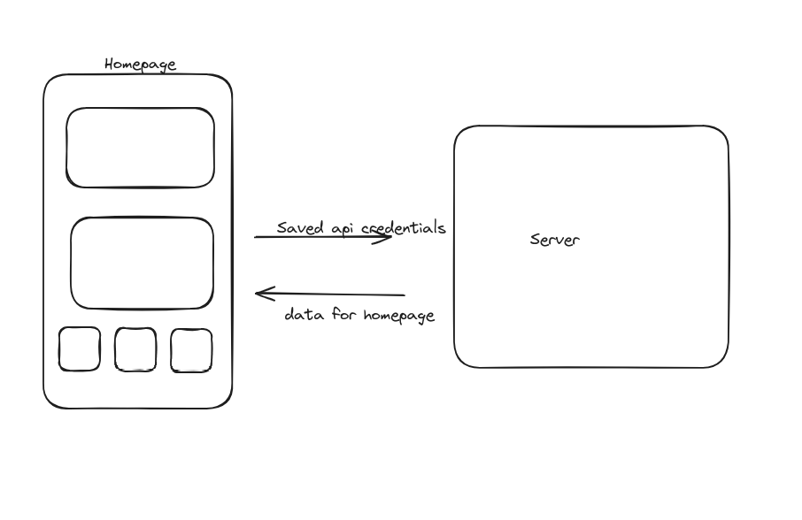

## Asessment application from shasa.thuo@gmail.com
### App features
- homepage
- Dynamic Homepage
- user Profile page
- navigation bar between homepage and user profile 

### Technologies Used

- React native
- Redux toolkit
- mirage(for the mock server)

## Screenshots

### Log In page

### Home Page

### Profile Page

## Log in flow
- Once a user logs in they access the homepage and can shift between homepage and loginpage

## Folder Structure

## Api design
On the login page, the user enters login info, any credentials will work, after which the server sends a secret key and api key, these keys are passed into the header of any subsequent request and used to authenticate the request. The mock server is in folder redux/Mockserver.js and utilises the mirage library 

### Get request for homepage data using provided credentials

Api calls are managed by redux toolkit using createasyncthunk